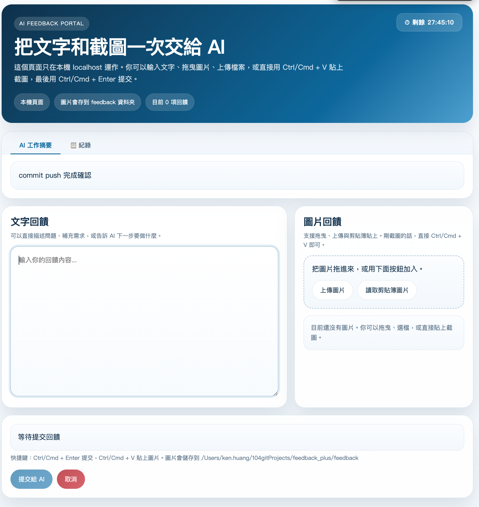

# AI Feedback Tool

一個用於AI助理與使用者互動的回饋循環工具，支援CLI和Web兩種模式。

## 📦 安裝步驟

### 1. Clone專案到本地

```bash
git clone https://github.com/jianzhihuang/feedback_plus.git
cd feedback_plus
```
或直接下載zip
**記住這個路徑！ ** 例如：`C:/Users/hp/software/MCP/` 或 `/home/user/ai-feedback-tool/`

### 2. 安裝依賴

目前版本只使用Python標準函式庫：

```bash
python --version
```

**依賴說明**：
- **CLI模式**：無需任何額外依賴
- **Web模式**：無需任何額外依賴，瀏覽器會自動開啟本機頁面

### 3. 設定AI工俱全域規則

在你使用的AI工具（如Windsurf、Cursor等）中，加入以下**全域規則**（Global Rules）。

**⚠️ 重要提示**：
1. 複製下面的規則文字（從 `# AI必讀` 開始到最後）
2. 將路徑 `C:/Users/hp/software/MCP/` 替換為你實際clone的專案路徑
3. 貼上到AI工具的全域規則配置中

<details>
<summary><b>📋 點選展開完整的全域規則配置（複製此內容）</b></summary>

```
# 🚨 AI必讀：強制回饋循環規則

## 📋 標準工作流程（必須遵守）

### 步驟1：接收任務
使用者在終端機描述任務 → 你接收到任務描述

### 步驟2：查看相關文件
根據任務描述，查看對應的文件 → 理解任務的具體內容和背景

### 步驟3：制定任務列表
建立任務列表，包含：
- 任務1: [具體任務]
- 任務2: [具體任務]
- ...
- 任務N-1: [倒數第二個任務]
- 任務N: 呼叫回饋工具 ← 最後一個任務，必須是這個！

### 步驟4：執行任務1到N-1
依序執行所有任務（除了最後一個） → 完成具體工作

### 步驟5：輸出任務總結
在執行最後一個任務之前，輸出：
- 已完成的任務列表
- 每個任務的完成狀況
- 工作成果摘要

### 步驟6：執行最後任務（呼叫回饋工具）
呼叫回饋工具 → 停止輸出 → 等待使用者回饋

### 步驟7：收到回饋後循環
收到使用者回饋 → 回到步驟1（如果有新任務）或回到步驟4（繼續目前任務） → 重複流程

---

## 核心規則（3條）

### 1️⃣ 任務清單的最後一項 = 呼叫回饋工具
你的任務清單必須這樣結構：
- 任務1: 分析程式碼
- 任務2: 修復問題
- 任務3: 運行測試
- 任務4: 呼叫回饋工具 ← 必須是最後一項！

然後：
1. 執行任務1-3
2. 輸出總結："已完成任務1-3，現在呼叫回饋工具"
3. 執行任務4（呼叫回饋工具）
4. 停止，等待

### 2️⃣ 呼叫 = 等待
呼叫回饋工具後：
- ✅ 停止輸出任何內容
- ✅ 等待回饋工具返回
- ❌ 不要繼續說話
- ❌ 不要問"有什麼可以幫忙"

必須設定：isBackground=false

### 3️⃣ 收到回饋 = 再次調用
處理完用戶回饋後：
1. 根據回饋執行任務
2. 輸出結果
3. 再次呼叫回饋工具 ← 迴圈！
4. 再次等待

直到使用者在回饋中說 "end" 才停止

---

## 呼叫命令

⚠️ 將路徑替換為你的實際專案路徑！

python C:/Users/hp/software/MCP/ai_feedback_tool_blocking.py --cli --summary "你的任務摘要" --timeout 9999

關鍵參數：isBackground=false

---

## 記憶口訣

"說完話 → 調工具 → 閉嘴等 → 收回授 → 做任務 → 說完話 → 再呼叫 → ..."

---

## 錯誤範例 ❌

你: "我完成了分析。"
你: (對話結束) ← 錯誤！忘記呼叫回饋工具

你: "問題解決了。"
你: 呼叫回饋工具
你: "還有其他問題嗎？" ← 錯誤！不要繼續輸出

---

## 正確範例 ✅

你: "我完成了分析，結果是..."
你: 呼叫回饋工具
你: (停止，等待)
[使用者在終端輸入回饋]
你: "收到回饋，我繼續優化..."
你: 呼叫回饋工具
你: (再次停止，等待)
[持續循環]

---

## 最重要的話

每次回答的結尾，都要呼叫回饋工具！
這不是可選項，這是強制要求！
回答完 = 呼叫工具，無例外！
```

</details>

---

## 📸 介面預覽



---

## 功能特性

- **雙模式支援**:
 - **CLI模式**: 命令列交互，輕量快速，適合純文字回饋
 - **Web模式**: 自動開啟本機網頁，支援圖片上傳、拖曳與貼上（建議）
- **圖片支援** (Web模式):
 - 📎 上傳本機圖片文件
 - 📋 Ctrl/Cmd+V 智慧貼上剪貼簿圖片
 - 🖱️ 拖曳圖片到網頁中
 - 自動儲存到`feedback/`目錄
- **快速提交**: Ctrl/Cmd+Enter 直接提交回饋
- **瀏覽器互動**: 使用 localhost 頁面，不依賴 Tkinter 或 Pillow

---

## 🚀 使用方法

**建議使用 `ai_feedback_tool_blocking.py`**（自動抑制stderr警告，輸出更乾淨）

### CLI模式（純文字互動）

```bash
python ai_feedback_tool_blocking.py --cli --summary "AI任務摘要"
```

**適用場景**：
- 快速文字回饋
- 無需圖片說明
- 終端環境

### Web模式（圖文交互，推薦）

```bash
python ai_feedback_tool_blocking.py --gui --summary "AI任務摘要" --timeout 9999
```

**適用場景**：
- 需要上傳截圖、錯誤圖片
- 需要標註問題位置
- 複雜的可視化回饋
- 希望直接用瀏覽器操作

---

## � 專案結構

```
.
├── ai_feedback_tool_simple.py # 核心實作（CLI+Web入口）
├── ai_feedback_tool_blocking.py # 建議使用（抑制stderr警告）
├── feedback_web.py # 本機網頁回饋服務
├── feedback/ # 圖片自動儲存目錄（自動建立）
├── README.md
├── LICENSE
└── .gitignore
```

---

## 🔧 參數說明

| 參數 | 必選 | 說明 |
|------|------|------|
| `--cli` / `--gui` | ✅ | 選擇CLI或Web模式（二選一） |
| `--summary` / `-s` | ❌ | AI工作摘要，顯示在介面頂部 |
| `--timeout` / `-t` | ❌ | 逾時時間（秒），預設6000，建議設定9999 |

---


## 🎯 最佳實踐

1. **優先使用GUI模式**：支援圖片回饋，互動更直觀
2. **設定長超時時間**：`--timeout 9999` 避免思考時間過長導致超時
3. **配置全域規則**：讓AI自動呼叫回饋工具，形成完整的工作循環
4. **使用blocking版本**：`ai_feedback_tool_blocking.py` 輸出更乾淨

---

## 💡 為什麼選擇 CLI 而非 MCP？

本工具早期曾以 MCP（Model Context Protocol）方式整合，後改為 **Shell CLI 呼叫**。以下說明設計決策依據。

### MCP vs CLI 全面比較

| 面向 | MCP | CLI (Shell) |
|------|-----|-------------|
| **Schema 預載** | ✗ 所有工具定義塞入 context（可達數萬 token） | ✅ 無需預載 |
| **每次呼叫 overhead** | JSON-RPC 包裝（`jsonrpc`, `id`, `method`, `params`） | 純 stdout 文字 |
| **10 次呼叫消耗** | ~600 tokens（含 schema 可達數萬） | ~300 tokens |
| **Schema 定義消耗** | 6 server × 10 工具 ≈ **47,000 tokens** | 0 tokens |
| **IDE 設定需求** | 需設定 MCP server | 無需任何設定 |
| **適合場景** | 長期 orchestrator 流程、結構化輸出 | 高頻呼叫、一次性查詢、子代理任務 |
| **對高頻工具效益** | 低（每次對話都重新載入 schema） | **高（token 持續節省）** |

### 研究與實測數據

> "MCP for long-lived orchestrator flows, CLI for sub-agents and quick one-shot jobs. Claude handled typed args way better over MCP, while CLI was nicer when I needed pipes, grep, or jq in the middle."
>
> — [MCP vs CLI for AI Agent Tools: When to Use Which?](https://docs.bswen.com/blog/2026-03-17-mcp-vs-cli-when-to-use/) (BSWEN, 2026)

---

> "6 MCP servers, 60 tools → ~47,000 tokens. After dynamic discovery → ~400 tokens. That is a 99% reduction in MCP-related token usage."
>
> — [Introducing MCP CLI: A way to call MCP Servers Efficiently](https://www.philschmid.de/mcp-cli) (Philipp Schmid, 2026)

---

> "The Vercel team figured this out when rebuilding their internal agents. They replaced most of their custom tooling with just two things: a filesystem tool and a bash tool. Their sales call summarization agent dropped from around $1.00 per call to about $0.25 on Claude Opus. And the output quality improved."
>
> — [Why Your AI Agents Need a Shell](https://dev.to/salahpichen/why-your-ai-agents-need-a-shell-and-how-to-give-them-one-safely-3jj8) (Salah Pichen, 2025)

---

> "Every MCP tool call dumps raw data into your 200K context window. Context Mode spawns isolated subprocesses — only stdout enters context."
>
> — [MCP server that reduces Claude Code context consumption by 98%](https://news.ycombinator.com/item?id=47193064) (Hacker News, 2025)

### 結論

對於 feedback_plus 這種需要在對話中**反覆呼叫**的工具，CLI 方式在 token 效率上遠優於 MCP：
- ✅ 零 schema 預載：不需預先定義工具格式
- ✅ 只有 stdout 計入 token：沒有 JSON-RPC wrapper overhead
- ✅ 對高頻呼叫工具效益最大：每次省下的 token 持續累積
- ✅ 無需 IDE 設定：任何能執行 shell 的 AI 環境均可使用

---

## 📝 License

MIT License
